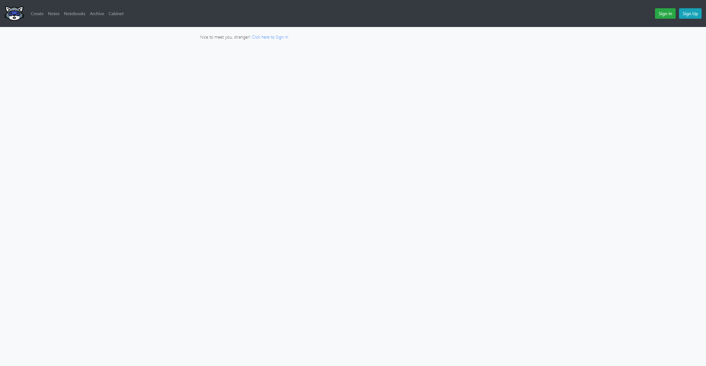
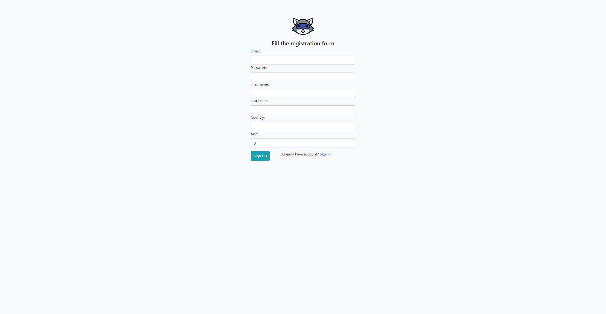
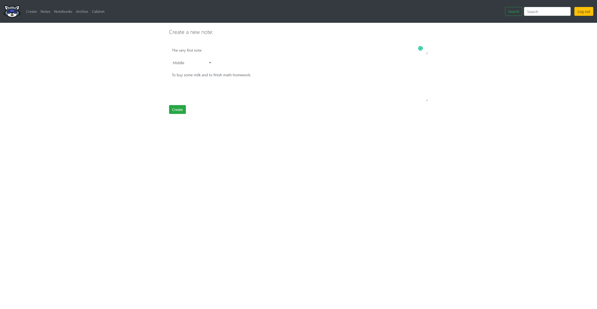
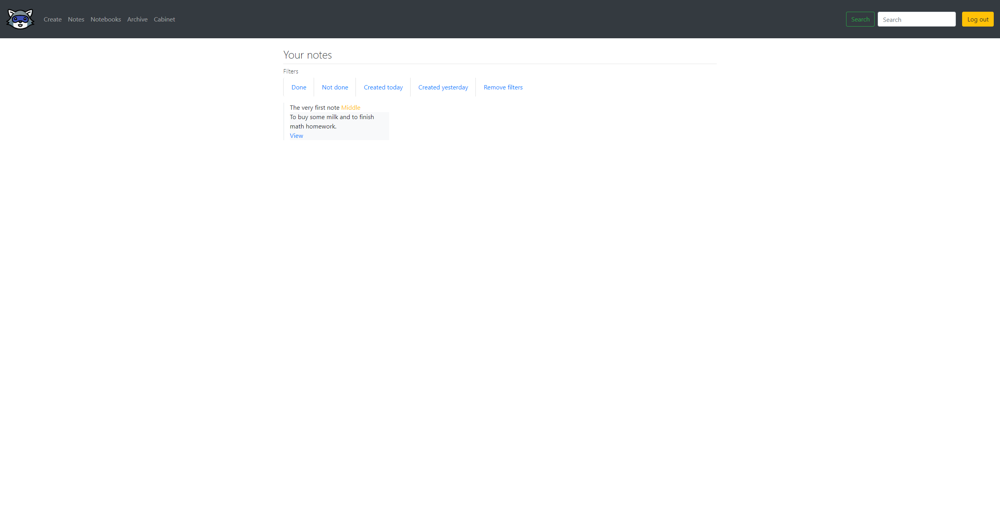
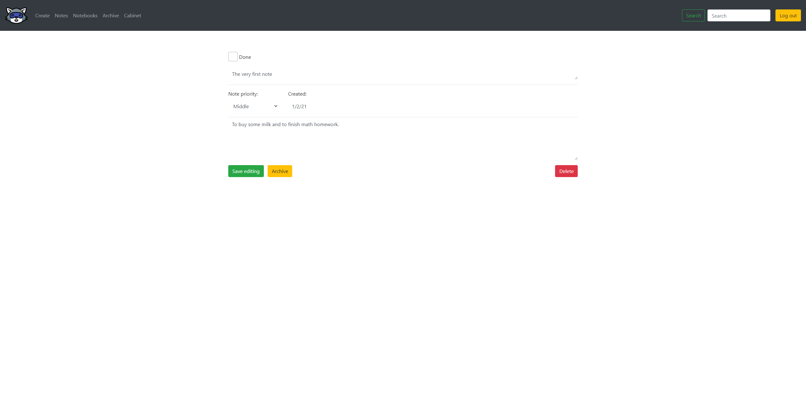
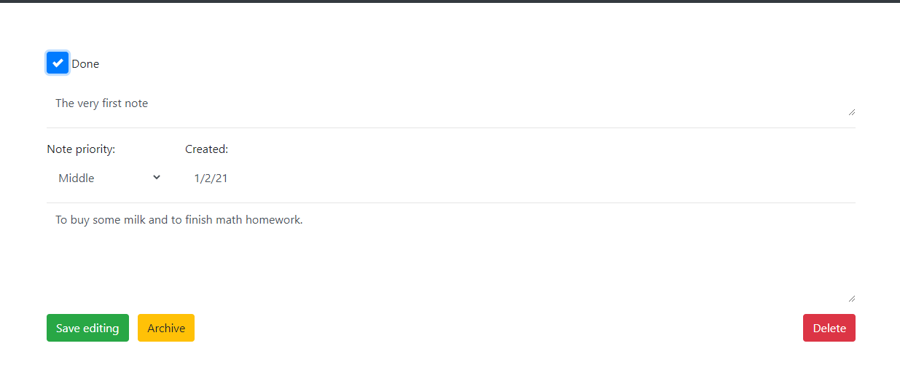
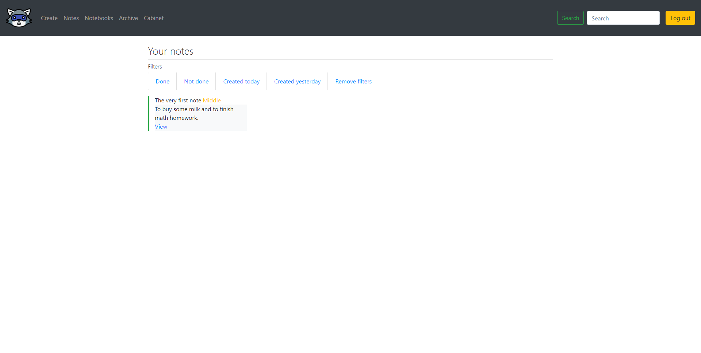
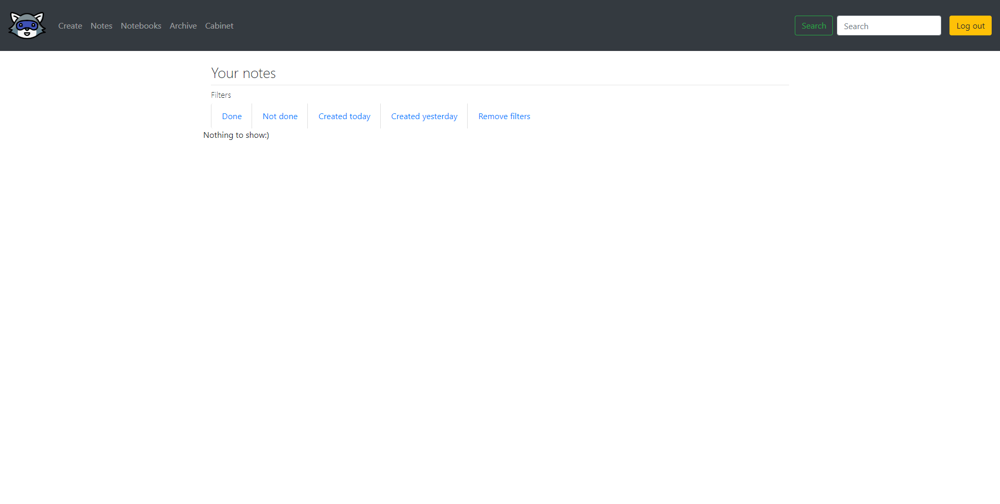

Icon made by [Smashicons](https://www.flaticon.com/authors/smashicons).

# enotes :notebook_with_decorative_cover:

**Enotes** is a web application for creating and managing personal notes.

### Subject area

A user can create his account using the registration form. Then he will be able to log in with it.
The application will provide high notes management system. Notes have headers and bodies. In
addition, they have priority marks, which can be Low, Middle or High.

### Definitions

- **User** - a customer of Enotes. To become a user you need to create an account using the
  registration form or using Rest API. Users can create and manage their notes, combine them into
  notebooks, etc;
- **Note** - a simple note, which includes a header, a body, and a priority mark (high, middle, low)
  . It can be created, modified and deleted by a user. Also, can be combined into a notebook;
- **Comment** - a comment for a note. Users can comment notes. Comments can be edited and deleted.
  -**NotesGalleryView** - the main page for every user, this page shows all user's notes. Using this
  page users can view, edit and delete notes.

### Tech part :mountain_cableway:

- The main project language is Java. The project includes such Java frameworks and libraries: Spring
  Data, Spring MVC, Spring Boot, Lombok, AspectJ, Log4J2. For unit tests, the project uses JUnit, H2
  database. Also, the project uses Thymeleaf;
- To represent front part I use Bootstrap 4 and jQuery (Bootstrap need it for some features);
- The project builds on the MVC pattern. But it also contains other patterns, such as Strategy, DAO,
  etc.
- To build the project I use Maven (at the first versions of the applications there was Gradle, but
  I decided to switch to Maven);
- The project uses MySQL Database as main, and H2 for testing. The main DB
  script [main.sql](main.sql);
- The project uses Apache Tomcat;

### Build and package

**Prerequisites** 
To build and package the application you need Java 8, Maven and MySQL installed. 
After you installed MySQL server, run the [main.sql](main.sql) to create the schema and required
tables.

**Build and package** 

1. Pull the project sources to your machine using Git;
2. Go to the root of the project and run `mvn package` in your console (terminal);

After the packaging finish, run the command to start the
application `java -jar target/enotes-1.0-SNAPSHOT.jar`. The application will be started (by default
the port is 8080). Open your browser and type `localhost:8080` to open the application.

### Use case

In this chapter, I will show you only the basic usage of the application.

After you typed `localhost:8080` in your browser and hit enter you will see the next page.

In the top right corner, you may see "Sign In" and "Sign Up" buttons. If you choose "Sign Up", the
page with the registration form will be loaded.

Fill in the required fields and click "Sign Up". Now you may sign in to the application using your
credentials.

Now, after you signed in, you can create your first note. Go to the "Create" page (in the header
menu).

Fill the header, changes the priority of the note (High, Middle, and Low), and add a note body.

Click the "Create" button. Now you may see your note at the "Notes" page.

Let's change this note. Click "view" below the note.

You can change the note data at the note view page: header, body, priority or mark the note as "
Done". You even can delete the note by the "Delete" button. 
Let's mark the note as "Done".

Clicking the "Save editing" button and going to the "Notes" page. You may see the green line near
the note. The green line means the note is done.

In the top panel, you may notice filters for notes. You may use them for more comfortable work with
notes. Let's click the "Not done" filter.

Nothing to show. And it's true because we marked our only note as "Done". 
That's it for a basic use case overview.

## Author 🦝

- Name: Evgeniy Kiprenko
- Email: zhenyakiprenko@gmail.com
- [LinkedIn](https://www.linkedin.com/in/kiprenko/)
